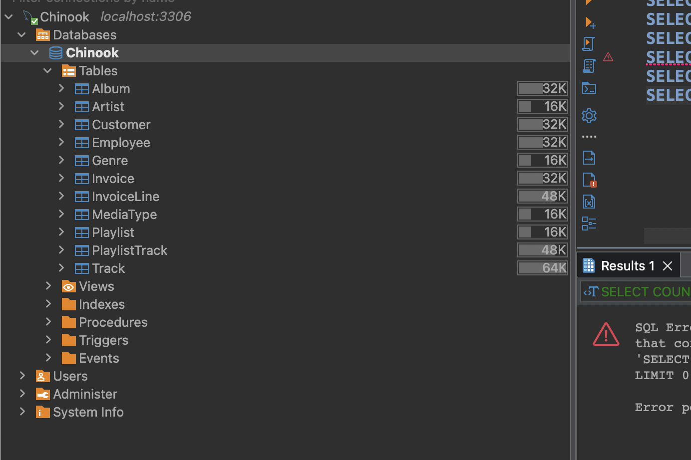

# Passo 0 — Configuração do BD MySQL Chinook (Docker)

Neste workshop usaremos o banco de dados de exemplo **Chinook** rodando em **MySQL** dentro do Docker.
Esta pasta contém:

* `Chinook_MySql.sql` — schema + dados iniciais
* `docker-compose.yml` — inicia o MySQL e carrega automaticamente o SQL inicial
* `Chinook_MySql_AutoIncrementPKs.sql` — ajusta PKs para auto-incremento

---

## 1) Iniciar o banco de dados

A partir da raiz do repositório:

```bash
cd 0-dbsetup
docker compose up -d
```

Isso irá:

1. Baixar uma imagem MySQL (se não estiver presente)
2. Iniciar um container na porta **3306**
3. Executar os scripts SQL em `/docker-entrypoint-initdb.d/` na primeira inicialização

Após o docker compose finalizar, você deve ver 1 container rodando chamado `chinook` e 1 imagem baixada para `mysql`, com logs similares aos abaixo:
```
[+] Running 2/2
 ✔ Network chinook_default    Created
 ✔ Container chinook-mysql-1  Started
 ```    

Verifique os logs se quiser confirmar a inicialização:

```bash
docker compose logs -f mysql
```

Você deve ver uma mensagem similar a "ready for connections".

---

## 2) Detalhes de conexão

O container está configurado com:

* **Host:** `localhost`
* **Porta:** `3306`
* **Database:** `Chinook`
* **Usuário:** `chinook`
* **Senha:** `chinook`
* **Senha root:** `chinook` (não necessária a menos que você prefira root)

---

## 3) Conectar usando DBeaver

1. Abra o **DBeaver**
2. **Database → New Database Connection**
3. Selecione **MySQL**
4. Preencha:

   * **Server Host:** `localhost`
   * **Port:** `3306`
   * **Database:** `Chinook`
   * **Username:** `chinook`
   * **Password:** `chinook`
5. Clique em **Test Connection**, depois **Finish**

### ⚠️ Se você receber um erro de autenticação / SSL (comum com MySQL 8+)

Nas configurações de conexão:

* Vá para **Driver properties**
* Configure:

  * `allowPublicKeyRetrieval = true`
  * `useSSL = false`

Ou adicione à URL JDBC (campo Driver properties / URL):

```
jdbc:mysql://localhost:3306/Chinook?allowPublicKeyRetrieval=true&useSSL=false
```

> 💡 **Ainda tendo problemas?** Verifique a seção [Problemas comuns e soluções](#problemas-comuns-e-soluções) abaixo para passos adicionais de solução de problemas.

---

## 4) Verificação rápida de saúde

Execute isso no DBeaver para confirmar que os dados foram carregados:

```sql
SHOW TABLES;

SELECT COUNT(*) FROM Artist;
SELECT COUNT(*) FROM Album;
SELECT COUNT(*) FROM Track;
SELECT COUNT(*) FROM Customer;
SELECT COUNT(*) FROM Invoice;
SELECT COUNT(*) FROM InvoiceLine;
```

Nenhuma dessas contagens deve ser `0`.

Ou simplesmente compare com a seguinte UI:


---

## 5) Parar / resetar o BD

Pare o container:

```bash
docker compose down
```

Se você quiser deletar todos os dados e recarregar do zero:

```bash
docker compose down -v
docker compose up -d
```

---

Uma vez que você esteja conectado e a verificação de saúde passe, prossiga para o **Passo 1 — SQL**.

## ⚠️ Problemas comuns e soluções
Se você ver o seguinte erro ao verificar os logs:
```bash
 Another process with pid 121 is using unix socket file.
 Unable to setup unix socket lock file.
 Aborting
```
Execute 
```bash
docker compose down -v
docker compose up -d
```

---
Se você ver o seguinte erro ao conectar pelo DBeaver:
`Public Key Retrieval is not allowed`
1. Edite a conexão,
2. Vá para driver properties,
3. Marque allowPublicKeyRetrieval como `TRUE`


# ━━━━━━━━━━━━━━━━━━━━━━━━━━━━━━━━━━━━
# English Version
# ━━━━━━━━━━━━━━━━━━━━━━━━━━━━━━━━━━━━

# Step 0 — MySQL Chinook DB Setup (Docker)

In this workshop we'll use the **Chinook** sample database running on **MySQL** inside Docker.
This folder contains:

* `Chinook_MySql.sql` — schema + data seed
* `docker-compose.yml` — starts MySQL and auto-loads the seed SQL
* `Chinook_MySql_AutoIncrementPKs.sql` — adjusts PKs to auto-increment

---

## 1) Start the database

From the repo root:

```bash
cd 0-dbsetup
docker compose up -d
```

This will:

1. Pull a MySQL image (if not present)
2. Start a container on port **3306**
3. Run the SQL scripts in `/docker-entrypoint-initdb.d/` on first startup

After docker compose finished, you should see 1 container running called `chinook` and 1 image pulled for `mysql`, with below similar logs:
```
[+] Running 2/2
 ✔ Network chinook_default    Created
 ✔ Container chinook-mysql-1  Started
 ```    

Check logs if you want to confirm initialization:

```bash
docker compose logs -f mysql
```

You should see a message similar to "ready for connections".

---

## 2) Connection details

The container is configured with:

* **Host:** `localhost`
* **Port:** `3306`
* **Database:** `Chinook`
* **User:** `chinook`
* **Password:** `chinook`
* **Root password:** `chinook` (not needed unless you prefer root)

---

## 3) Connect using DBeaver

1. Open **DBeaver**
2. **Database → New Database Connection**
3. Select **MySQL**
4. Fill in:

   * **Server Host:** `localhost`
   * **Port:** `3306`
   * **Database:** `Chinook`
   * **Username:** `chinook`
   * **Password:** `chinook`
5. Click **Test Connection**, then **Finish**

### ⚠️ If you get an auth / SSL error (common with MySQL 8+)

In the connection settings:

* Go to **Driver properties**
* Set:

  * `allowPublicKeyRetrieval = true`
  * `useSSL = false`

Or add to the JDBC URL (Driver properties / URL field):

```
jdbc:mysql://localhost:3306/Chinook?allowPublicKeyRetrieval=true&useSSL=false
```

> 💡 **Still having issues?** Check the [Common issues and workarounds](#common-issues-and-workarounds) section below for additional troubleshooting steps.

---

## 4) Quick healthcheck

Run this in DBeaver to confirm data is loaded:

```sql
SHOW TABLES;

SELECT COUNT(*) FROM Artist;
SELECT COUNT(*) FROM Album;
SELECT COUNT(*) FROM Track;
SELECT COUNT(*) FROM Customer;
SELECT COUNT(*) FROM Invoice;
SELECT COUNT(*) FROM InvoiceLine;
```

None of these counts should be `0`.

Or simply compare with the following UI:


---

## 5) Stopping / resetting the DB

Stop the container:

```bash
docker compose down
```

If you want to delete all data and re-seed from scratch:

```bash
docker compose down -v
docker compose up -d
```

---

Once you're connected and the health check passes, proceed to **Step 1 — SQL**.

## ⚠️ Common issues and workarounds
If you see the following error when checking the logs:
```bash
 Another process with pid 121 is using unix socket file.
 Unable to setup unix socket lock file.
 Aborting
```
Run 
```bash
docker compose down -v
docker compose up -d
```

---
If you see the following error when connecting to it from DBeaver:
`Public Key Retrieval is not allowed`
1. Edit the connection,
2. Go to driver properties,
3. Mark allowPublicKeyRetrieval as `TRUE`
