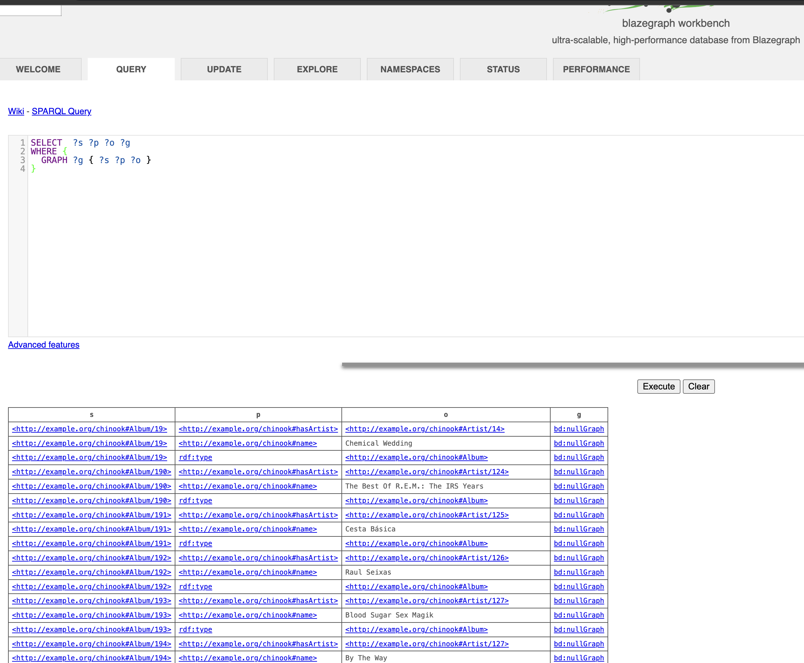

# Blazegraph Step

Start:
```bash
docker run --name blazegraph -d -p 8889:8080 lyrasis/blazegraph:2.1.5
```

Load RDF:
```bash
# If you get "Permission denied", make the script executable first:
chmod +x load_rdf.sh

./load_rdf.sh
# Windows: ./load_rdf.ps1
```

Open Blazegraph UI:
http://localhost:8889/bigdata/#query


Now check the data is there on the QUERY section:
```sparql
SELECT  ?s ?p ?o ?g
WHERE {
  GRAPH ?g { ?s ?p ?o }
}
```

You should be able to see this:
